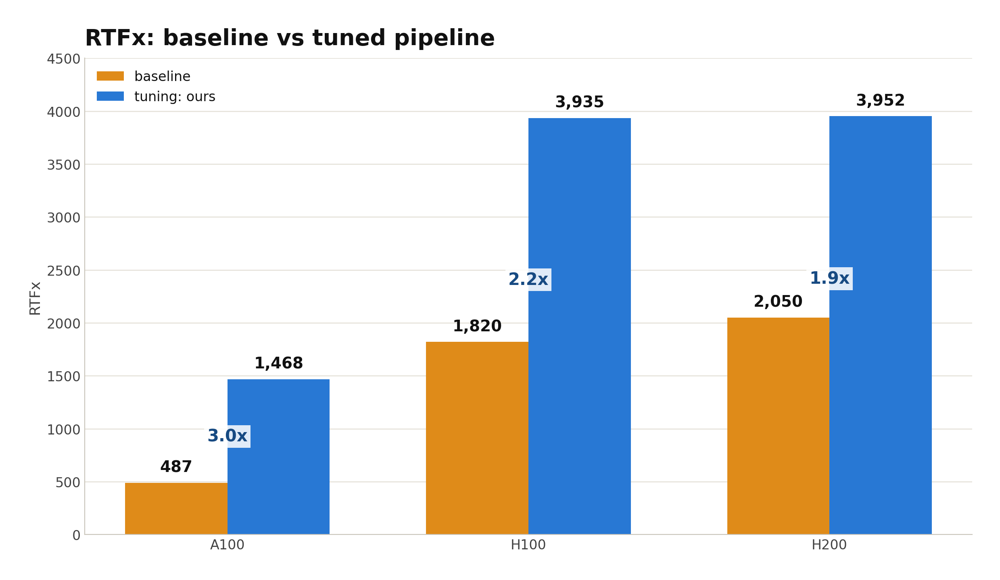
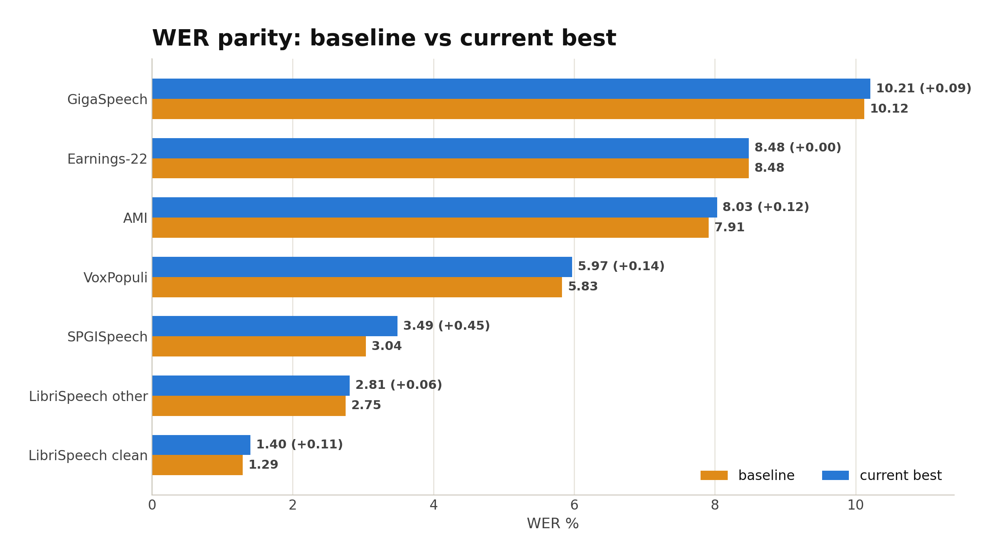
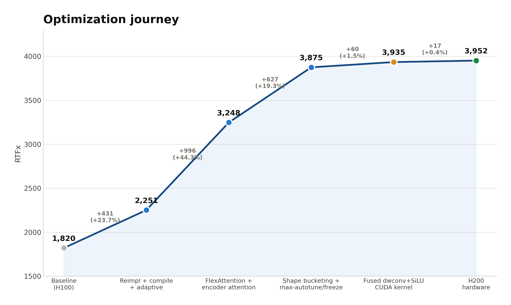

# Granite-Speech-4.1-2B-NAR-Turbo

Hand-tuned pure-PyTorch inference stack for
[`ibm-granite/granite-speech-4.1-2b-nar`](https://huggingface.co/ibm-granite/granite-speech-4.1-2b-nar)
(non-autoregressive CTC-editing ASR, [NLE architecture](https://arxiv.org/abs/2603.08397)) —
**~3× the official HuggingFace implementation head-to-head, ~2.2× the model card's published
RTFx — WER verified against the reference: the full-editor pass matches it head-to-head, and the
shipped adaptive path adds ≤0.08 WER.**

| GPU | RTFx (e2e) | RTFx (model-only) | WER j/k | VRAM |
|---|---:|---:|---|---:|
| H200 SXM | **3951.5** | 4135.7 | 1.29 / 1.10 | 13.1 GB |
| H100 SXM | **3934.7** | 4025.7 | 1.27 / 1.09 | 13.0 GB |
| A100 PCIE 40GB | **1468.4** | 1489.1 | 1.27 / 1.10 | 13.1 GB |
| *(reference impl, A100, documented path)* | *487.0* | — | *1.38 / 1.15* | *6.0 GB* |

RTFx = total audio seconds ÷ wall-clock inference seconds (mel + model + decode), LibriSpeech
test.clean, 500-clip subset, bf16, batch 128 (executed in chunks of 48). IBM's model card reports
~1,820 RTFx on H100 at batch 128.



## WER — verified, not assumed

**Head-to-head vs the official implementation** (same audio, same scorer, same GPU) — this is the
full-editor pass the adaptive router falls back to for hard utterances, so the editor itself is
reference-exact:

| dataset (full test set) | this repo (full-editor) | official impl |
|---|---:|---:|
| LibriSpeech clean | 1.38 | 1.38 |
| LibriSpeech other | 2.76 | 2.79 |
| AMI | 7.98 | 8.09 |
| SPGISpeech (39,341 utts) | 3.49 | 3.48 |

**Vs the model card** (same stated methodology — greedy, bf16, jiwer + Whisper EnglishTextNormalizer),
shipped adaptive path:

| dataset | model card | this repo (adaptive) |
|---|---:|---:|
| LibriSpeech clean | 1.29 | 1.40 |
| LibriSpeech other | 2.75 | 2.81 |
| AMI | 7.91 | 8.03 |
| Earnings-22 | 8.48 | **8.48** |
| GigaSpeech | 10.12 | 10.21 |
| SPGISpeech | 3.04 | 3.49* |
| VoxPopuli | 5.83 | 5.97 |

*The SPGISpeech gap lives in the scoring pipeline, not the model: the official implementation
scores 3.48 through this repo's scorer (see head-to-head above). WER absolute numbers are only
comparable within one scoring pipeline — even IBM's own two published numbers disagree per set
(e.g. GigaSpeech 10.12 model card vs 8.67 leaderboard).



## What makes it fast

- **`torch.compile` max-autotune with frame-grid bucketing** — audio lengths are bucketed to a
  fixed grid (`FRAME_GRID=128`) so Inductor compiles a bounded shape set instead of recompiling
  per length.
- **Chunked logical batching (`EXEC_BATCH`)** — a logical batch of 128 is executed as
  length-trimmed chunks of ≤48: kills padding waste and avoids an Inductor autotune failure class
  at b≥64. This is what makes large-batch beat small-batch.
- **One hand-written CUDA kernel that beats the compiler** — fused depthwise-conv(k15)+bias+SiLU
  after BatchNorm folding (`models/granite_speech_nar/conv_kernel.py` + `cuda_kernels/conv1d.py`),
  registered as a `torch.library` custom op: one opaque node, fullgraph-safe, zero graph breaks.
  Microbench +19–32% across A100/H100/H200; end-to-end +0.6–1.5%. Falls back to the eager path
  automatically if NVRTC compilation or the numerical test-fire fails (look for `convkernel(16)`
  vs `convkernel(0)` in logs).
- **Confidence-routed adaptive inference** (the shipped inference path, `configs/routing.yaml`) —
  easy utterances exit via the CTC hypothesis; only hard ones pay for the full LLM-editor pass.
  ≤ +0.08 WER points on every set measured (free on Earnings-22 and GigaSpeech).
- **FlexAttention + restructured encoder attention** (`flexattn`, `encattn`, `encdense` levers)
  for the Conformer block-attention and relative-position path.

### What did **not** work (measured, so you don't have to)

- Hand-written GEMM / attention kernels: lose **10–70×** to cuBLAS / SDPA. The losing kernels are
  kept in `cuda_kernels/` for reference.
- GLU-fused depthwise conv: **+17% on RTX 3060, −45% on H100** — memory-bound wins flip to
  ALU-bound losses on high-bandwidth parts. Always re-gate microbenches on the target GPU
  (`(cd script && python -m cuda_kernels.conv1d)`).
- Chunked 100k-vocab text-head argmax: same HBM bytes, more launches (a real fix needs a fused
  GEMM epilogue).



## Install

**Prerequisites:** an NVIDIA GPU with driver CUDA ≥ 12.8, and a **C compiler on `PATH`** (`gcc` /
`build-essential`). The whole pipeline runs through `torch.compile`, and Triton/Inductor
JIT-build their kernels at runtime — a stock `pytorch/pytorch:*-runtime` (or any minimal) image
has no compiler and fails with `InductorError: Failed to find C compiler`. On a stripped image:

```bash
apt-get update && apt-get install -y build-essential   # or use a *-devel CUDA base image
```

```bash
pip install -r requirements.txt          # torch 2.9.1 + deps
# NOTE (2026-07): the cu130 pip index no longer lists torch 2.9.x — install from the cu128 index
# or pin the direct wheel URL; a torch other than 2.9.x is an unproven stack for these numbers.
```

## Quickstart

```bash
# 1) fetch the model (≈4.3 GB) and symlink it to ./ref
python - <<'EOF'
from huggingface_hub import snapshot_download
print(snapshot_download("ibm-granite/granite-speech-4.1-2b-nar",
      allow_patterns=["config.json","model.safetensors","tokenizer.json","*.wav"]))
EOF
ln -s <printed_path> ref

# 2) reproduce the record run (subset-500, all levers, b128/exec48)
python script/best_run.py

# 3) full-set WER gates
python script/best_run.py --variant gate_clean --split test.clean --max-samples 0
python script/best_run.py --variant gate_other --split test.other --max-samples 0
```

Direct harness invocation (all levers explicit):

```bash
FRAME_GRID=128 EXEC_BATCH=48 ENC_COMPILE_MODE=max-autotune-no-cudagraphs \
python script/bench_asr.py \
  --levers compile-enc,compile-proj,compile-llm,texthead,adaptive,flexattn,encattn,encdense,freeze,convkernel \
  --model-dir "$(readlink -f ref)" --config librispeech --split test.clean \
  --batch 128 --max-samples 500 --no-probe
```

## Serving

Two production backends wrap the same engine (`serve/engine.py`) — pick by your ops stack; full
comparison + tuning notes in [`serve/README.md`](serve/README.md).

```bash
# Ray Serve — pure Python, easiest to extend
MODEL_DIR=ref PYTHONPATH=. serve run serve.ray_app:app

# Triton — binary gRPC + system shared-memory transport, C++ scheduler
docker build -t granite-asr-triton -f serve/triton/Dockerfile .
docker run --gpus 1 --rm -p 8000:8000 -p 8001:8001 granite-asr-triton

# load test either backend with the same client
python script/serve_client.py --backend triton --protocol grpc --shm -c 32 -n 256
```

Measured on A100 SXM4 (real LibriSpeech, warm): the fastest config is **one Triton instance,
gRPC + system shared-memory — 739 RTFx @ concurrency 32**. gRPC+shm beats plain gRPC by ~30% at
high load, and `instance_group: 2` (two engines per GPU) *hurts* this compute-bound model.

## Repo layout

```
script/                          core code (script/ is the import root)
├── bench_asr.py                 the benchmark harness behind every number in this README
├── best_run.py                  one-command record-run entry point
├── fast_demo.py                 single-wav demo (latency / RTFx)
├── serve_client.py              unified load-test client for both serving backends
├── models/granite_speech_nar/   pure-PyTorch reimplementation (encoder/projector/LLM editor,
│                                adaptive routing, BN folding, custom-op integration)
├── cuda_kernels/                the winning fused dwconv+bias+SiLU NVRTC kernel
│                                (self-benchmark: cd script && python -m cuda_kernels.conv1d)
├── fast/                        compile-friendly serving wrapper (FastGraniteASR, 30s chunking)
├── best/                        record-run configuration constants
└── configs/routing.yaml         adaptive-routing thresholds
serve/                           Ray Serve + Triton backends over one shared engine (imports
                                 fast/ + models/ from script/; run with PYTHONPATH=. — see serve/README.md)
media/                           result charts embedded in this README
ref/                             model snapshot (gitignored — see Quickstart)
results/                         benchmark outputs (gitignored)
```

## Methodology notes

- WER: jiwer (corpus-level) on Whisper-`EnglishTextNormalizer`-normalized text, kaldialign as a
  second opinion; empty normalized references dropped. Identical scorer applied to both this repo
  and the reference implementation for every claim above.
- Run-to-run noise on one instance is ±0.6% RTFx; sub-1% deltas need repeats.
- Numbers were measured on Vast.ai instances (driver CUDA 13.0, torch 2.9.1+cu130).

## License & acknowledgments

Apache-2.0 (matching the upstream model license). Model weights & architecture:
[IBM Granite](https://huggingface.co/ibm-granite) — this repo contains no weights.
Evaluation data: [ESB / Open ASR Leaderboard](https://huggingface.co/spaces/hf-audio/open_asr_leaderboard).
